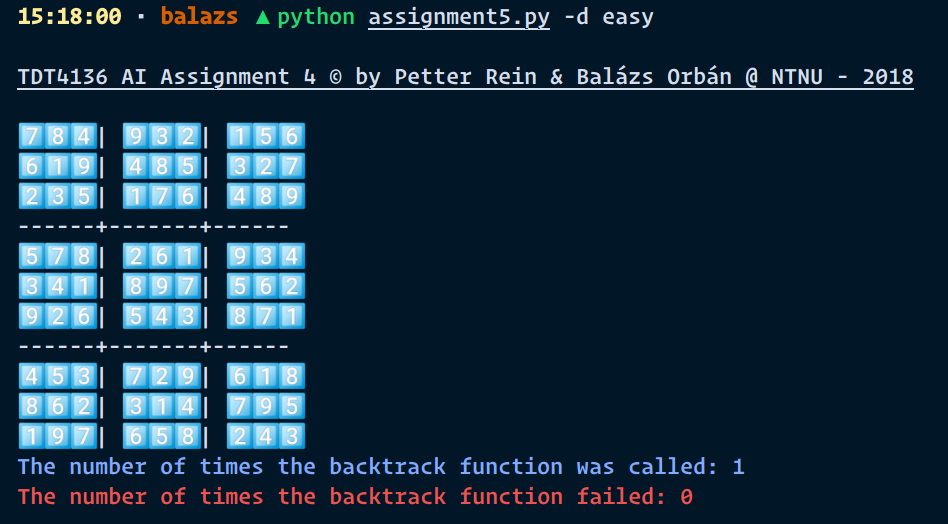
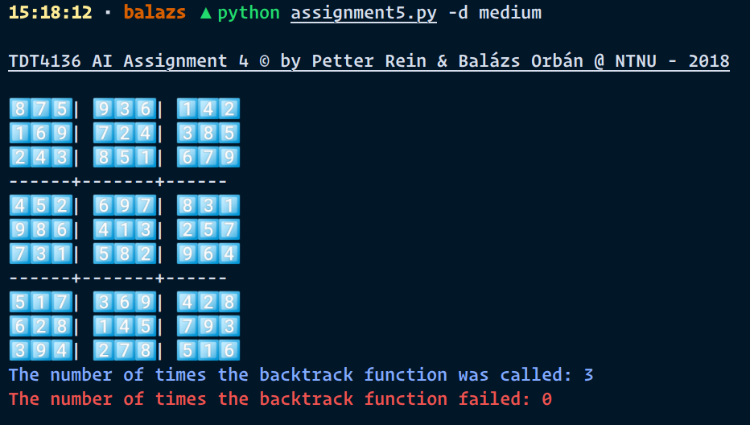
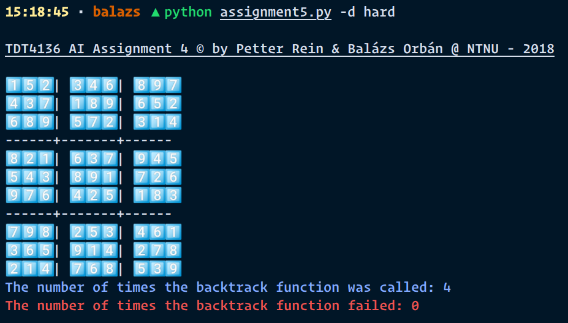
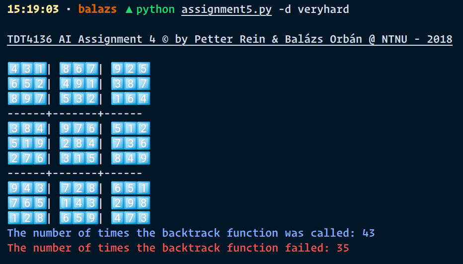

## TDT4136 AI Assignment 4 © by Petter Rein & Balázs Orbán @ NTNU - 2018

Available flags are:

    --help, -h - Show help
    --difficulty, -d - Specify the source file for the input
      available values: easy, medium, hard, veryhard

Results:
easy 
_Only one AC-3 call is needed because the board is very easy_

medium 
_Only 3 AC-3 calls are needed because the board is still easy_

hard 
_Surprisingly, the hard board requires only one more call_

veryhard 
_Surprisingly, the veryhard board requires much more calls, and have some failures_
